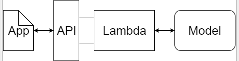
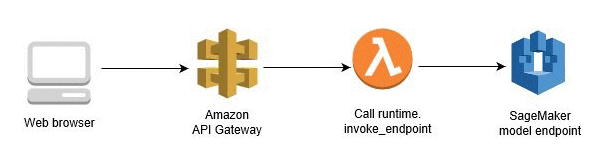
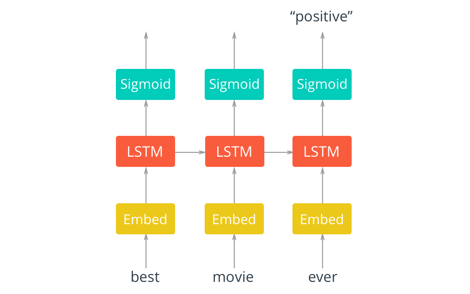
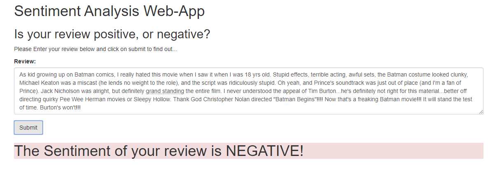

# Deployed_Sentiment_Analysis_Model

 In this project, I used SageMaker to construct a complete project from end to end. The goal of this project is to make A simple web app which interacts with a deployed recurrent neural network performing sentiment analysis on movie reviews.
 The web page will then send the review off to my deployed model which will predict the sentiment of the entered review.
 
 Trained and deployed on AWS cloud.
 

1. Used BeautifulSoup to remove any HTML formatting that may have appeared.

2. Used NLTK to stem the words.

3. Used AWS Lambda function for tokenization & conversion of review to suitable type.

4. Used API Gateway to create endpoint & to forward the data to lambda function.

5. Used AWS SageMaker for creating Notebook Instances, Training jobs, Endpoints, Models & Batch Transform jobs.

## When someone uses our web app, the following will occur.

1. To begin with, a user will type out a review and enter it into our web app.

2. Then, our web app will send that review to an endpoint that we created using API Gateway. This endpoint will be constructed so that anyone (including our web app) can use it.

    *(This solves the authentication issue of AWS. some extra work needs to be done since AWS allows only authenticated objects to access the endpoint).*

3. API Gateway will forward the data on to the Lambda function

4. Once the Lambda function receives the user's review, it will process that review by tokenizing it and then creating a bag of words encoding of the result. After that, it will send the processed review off to our deployed model.

    *(This solves the problem of tokenization. Since AWS expects the input to be in bag-of-words form whereas users type the review as a string.)*

5. Once the deployed model performs inference on the processed review, the resulting sentiment will be returned back to the Lambda function.

6. Our Lambda function will then return the sentiment result back to our web app using the endpoint that was constructed using API Gateway.

### Contents

- General Outline
- Step 1: Downloading the data
- Step 2: Preparing and Processing the data
- Step 3: Upload the data to S3
- Step 4: Build and Train the PyTorch Model
- Step 5: Testing the Model
- Step 6: Deploying the model for testing
- Step 7: Use the model for testing
- Step 6 (again): Deploy the model for the web app
- Step 7 (again): Use the model for the web app

### Dataset

[IMDB Dataset](https://ai.stanford.edu/~amaas/data/sentiment/)

# Results

## Or Look at this [Youtube Video](https://www.youtube.com/playlist?list=PL9vx_VYEb3N1AGQoFsrGlkKtFNiNhQCJb)

.

## Future Tasks to make the Project Stand Out

### 1 MAKE A BETTER WEB APP
   The web app in this project simply reports to the user whether the predicted sentiment was positive or negative. thinking of a better web app that uses the same model?

### 2 IMPROVE THE WEB APP APPEARANCE
   The provided web app is very simple and there is plenty of room for improvement h to stretch my web developer skills. Making a better front end and overall a better web-app.

### 3 IMPROVE THE MODEL
   The model chosen here is a straightforward RNN with a single hidden layer. There are many different model architectures that you could try to see if they improve the results. Will read research papers for better architectures and hyperparameters and then implementing them to improve the model.
